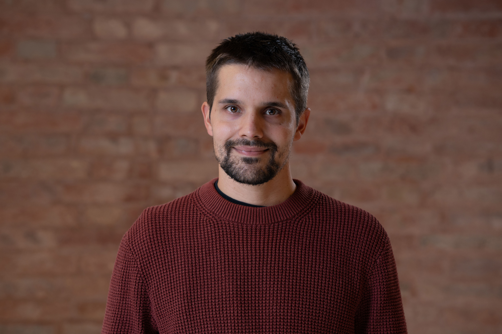

  

  

    Researcher in Social Statistics 
    Department of Economics, Ca’ Foscari University of Venice
  

I am a social and applied statistician. My research starts from substantive
problems in health, society, the environment and sport. These problems often
involve complex data: observations repeated over time, geographical and
population heterogeneity, multiple sources of uncertainty, missing information
and relationships that cannot be adequately represented by simple models.

I develop and apply statistical methods that account for this complexity while
remaining interpretable and useful for researchers, institutions and
decision-makers. My methodological interests include Bayesian statistics,
hierarchical and state-space models, time series, computational statistics,
survey data and interpretable machine learning.

I am currently a fixed-term researcher (RTD-A) at Ca’ Foscari University of Venice, where I work on the [PLANET4HEALTH](https://planet4health.eu/) project and am a member of the [so.sta. — Social Statistics](https://so-sta.github.io/) research team. I previously worked on health inequalities and multimorbidity within the Age-It project. I received my PhD in Statistical Sciences from the University of Padova in 2022 with a dissertation on sports performance analysis using state-space models.

<a href="mailto:mattia.stival@unive.it">Email</a> ·
<a href="https://scholar.google.com/citations?user=570rAmEAAAAJ">Google Scholar</a> ·
<a href="https://orcid.org/0000-0003-0657-0349">ORCID</a> ·
<a href="https://www.unive.it/data/persone/27087816">Ca’ Foscari profile</a>

